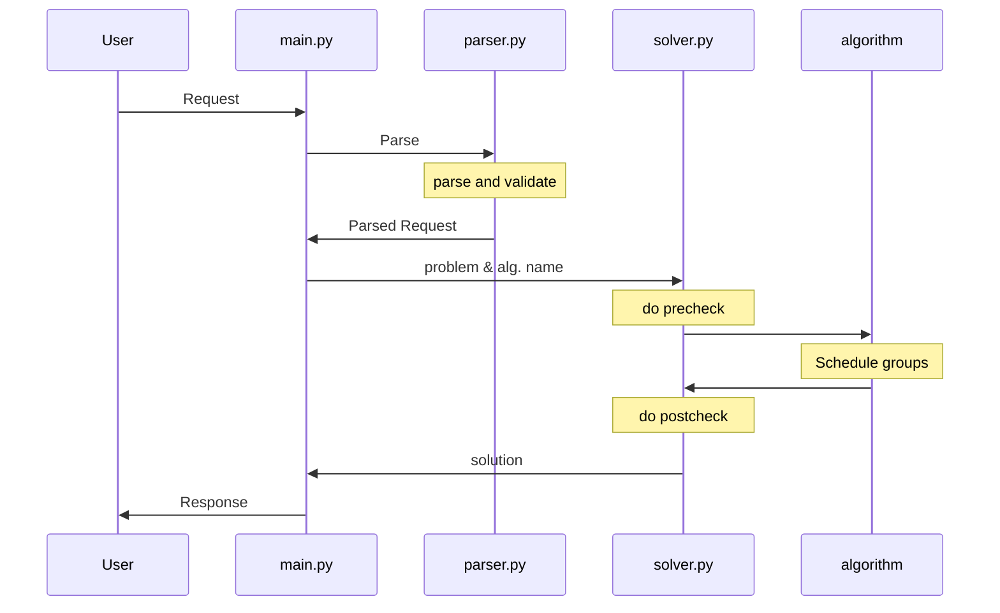
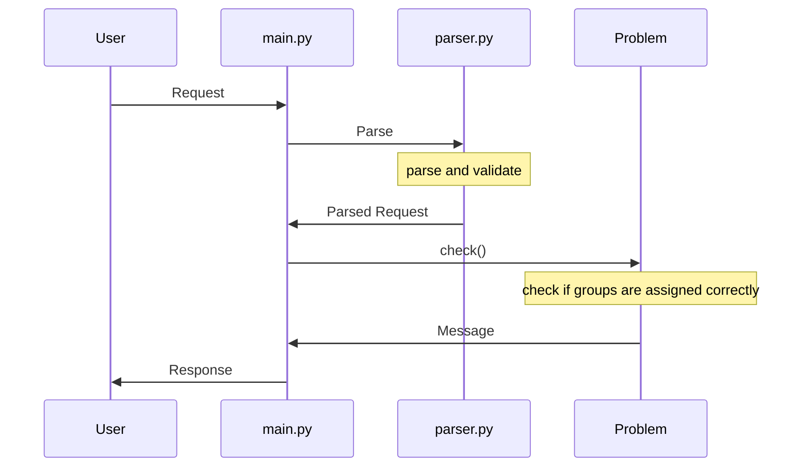

# Project Architecture

## Main Script

`main.py` is the main entry point of the application. It defines the FastAPI server, exposes HTTP endpoints, and coordinates request parsing, validation, and problem solving using the `Parser` and the `Solver`.

## Parser

Parses the requests from JSON to internal objects. While doing so it checks for logical or semantic errors in the request.

## Solver

Serves as an interface to the *algorithms*. First it ensures user defined allocations are do not break any constraints. Then it passes the problem to further to the chosen algorithm. Lastly it ensures that the algorithm produced valid group allocations and returns the solution.

## Schedule request flow

## Check request flow

